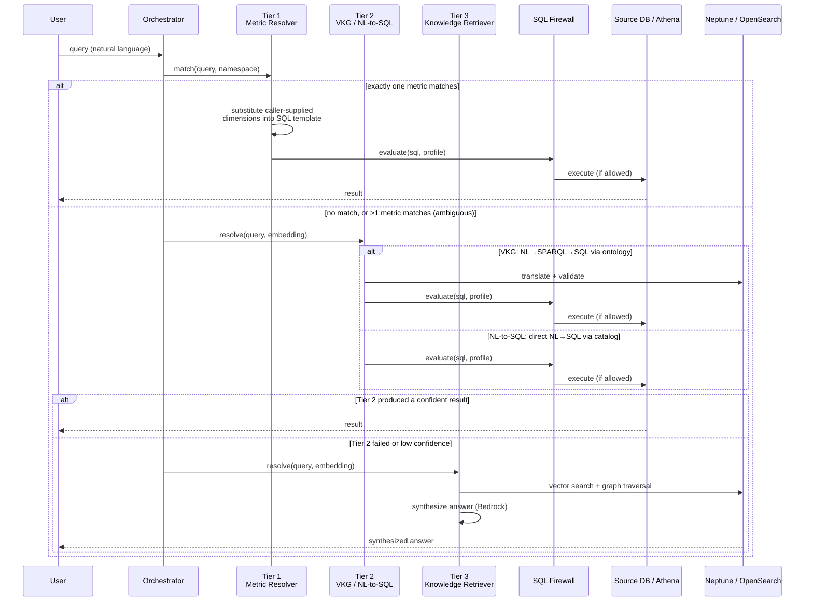

# Serve

The Serve layer is how users and AI agents query Context Ontology Accelerator. It orchestrates across multiple resolution strategies to answer natural language questions using your semantic context — metrics, ontologies, knowledge graphs, and source data.

!!! tip "Full request/response schemas"
    For the complete request/response schema for every Serve endpoint below,
    see the **[API Reference](#/api-reference)** (Data Layer (Serve) API) —
    it's generated directly from the API contract and always current.

## Query Interfaces

### Playground (Web App)

The built-in Playground provides an interactive chat interface:

1. Navigate to **Playground** in the web app
2. Select a namespace
3. Ask questions in natural language

The Playground streams responses in real-time via SSE (Server-Sent Events), showing:

- **Resolution steps**: which strategy is being tried
- **Generated SQL**: the query produced for your data
- **Results**: tables, summaries, or explanations
- **Conversation history**: multi-turn context within a session

### REST API

`POST /namespaces/{namespaceId}/query` with a natural-language `query` and
optional `options` — see **Query** in the [API Reference](#/api-reference)
for the full request/response schema.

Options:
- `execute: false` — return the generated SQL without executing it
- `tierOverride` — force a specific resolution tier (1, 2, or 3)
- `maxResults` — limit result rows
- `includeSupporting` — include supporting context in the response

### MCP (Model Context Protocol)

For AI agents (Claude, Amazon Q, etc.), Context Ontology Accelerator exposes an MCP server via Streamable HTTP on AgentCore Runtime with tools for:

- Querying namespaces with natural language
- Listing and describing governed metrics
- Describing ontology schema (classes, properties, tables)
- Translating natural language to SPARQL
- Retrieving semantically similar document chunks
- Traversing the semantic graph for entity relationships

See the [Agent Access Guide](agent-access.md) for authentication setup and the MCP server's README (`packages/mcp-server/README.md` in the repository) for MCP client configuration.

## Resolution Tiers

Context Ontology Accelerator uses a tiered resolution strategy, trying the most precise approach first. Each tier falls through to the next on a miss:

`tierOverride` (1, 2, or 3) in the request `options` skips straight to a
specific tier instead of falling through — useful for testing or when you
already know which tier should answer a question. Source-composition gating
also skips tiers automatically: a document-only namespace has no relational
data, so Tier 1 and Tier 2 are skipped; a database-only namespace has no
document index, so Tier 3's vector-search step self-skips (graph traversal
and synthesis still run over the ontology graph).

### Tier 1 — Metric Resolution

**When**: The question matches exactly one defined metric (semantic similarity search). If more than one metric matches, the question is ambiguous for Tier 1 and resolution falls through to Tier 2/3 instead of guessing.

The system:
1. Embeds the query and searches metric definitions
2. Finds the best-matching metric
3. Retrieves its SQL expression
4. Executes the SQL against the source database

**Example**: *"What is total revenue?"* → matches `total_revenue` metric → `SUM(orders.total_amount)`

### Tier 2 — Structured Query (NL-to-SQL)

**When**: No metric matches, but the question can be answered from source tables

Two sub-strategies:

- **VKG (Virtual Knowledge Graph)**: Translates NL → SPARQL via the ontology, then SPARQL → SQL via Ontop mappings
- **NL-to-SQL**: Direct natural language to SQL translation using the catalog schema

The SQL Firewall validates all generated SQL before execution (only SELECT allowed, table/column access controls enforced).

### Query execution paths (Tier 1 & Tier 2)

Once SQL is validated, the serve layer routes it to the cheapest correct engine —
this is automatic and requires no configuration:

- **Direct JDBC** — a **single-source** query against a direct-SQL-capable database
  (PostgreSQL, Redshift, MySQL, SQL Server) executes straight over the engine's native
  async driver. This is the low-latency path (~20–50 ms typical). The Trino SQL is
  transpiled to the engine's own dialect first (e.g. `LIMIT`→`TOP` for SQL Server), and
  a root-level row cap is applied.
- **Athena federation** — **cross-source** queries, and any source without a direct
  path (Glue-catalog sources), execute through the Athena federated catalog
  (~500–800 ms typical). This is the fallback whenever the direct path can't serve the
  query, so a request always resolves.

The choice is derived from the source's `queryEngine` (set at onboarding) and the query
shape (single- vs cross-source); see the [Sources Guide](sources.md#direct-sql-vs-athena-federated).

### Tier 3 — Knowledge Retrieval

**When**: The question requires unstructured knowledge or graph traversal

- **Vector search**: finds relevant context from embedded ontology entities and documents
- **Graph traversal**: walks the Neptune knowledge graph for connected concepts
- **Synthesis**: combines retrieved context into a natural language answer using Bedrock

## Access Control on Queries

Every query passes through the Cedar authorization and SQL Firewall:

1. **Cedar**: Checks if the user's roles allow `query` on the target namespace
2. **SQL Firewall**: Enforces per-user table allowlists and column denylists
3. **Metric allowlist**: Restricts which metrics a user can resolve (if configured)

These restrictions are configured via [Namespace Management Guide](namespaces.md) permissions.

## Sessions and Conversation History

The Playground maintains conversation sessions:

- Sessions persist across page reloads
- Multi-turn context enriches subsequent queries (the system remembers what you asked before)
- Session history is stored in DynamoDB with user ownership validation

## Translate and Search APIs

In addition to full query resolution:

- `POST /namespaces/{namespaceId}/translate` — translate NL to SPARQL without executing (**TranslateSPARQL**)
- `POST /namespaces/{namespaceId}/kb/search` — semantic search across the knowledge base (**KBSearch**)
- `POST /namespaces/{namespaceId}/graph/traverse` — traverse the knowledge graph (**GraphTraverse**)
- `GET /namespaces/{namespaceId}/schema` — discover the queryable schema (**DescribeSchema**)

`DescribeSchema` returns the classes and properties currently loaded into the namespace's ontologies, so a caller can find the entities available before writing a query. Optional query params: `includeProperties` (default `true`) to include class properties, and `maxResults` to cap the class count. The same schema is what the MCP `describe_schema` tool exposes — REST and MCP read from one source.

See these operations in the [API Reference](#/api-reference) for their full request/response schemas.

## Troubleshooting

| Symptom | Likely Cause | Fix |
|---------|--------------|-----|
| 403 Access Denied | No role grant for this namespace | Grant the user a role via Permissions |
| Empty results | No metrics/ontology defined | Connect sources, define metrics, or induce ontology first |
| SQL Firewall denied | User's grant restricts access to referenced tables | Update the user's table allowlist |
| 504 Timeout | Query resolution exceeded 29s | Simplify the question or check Lambda cold starts |
| "No tier produced results" | Question doesn't match any resolution strategy | Rephrase, or ensure relevant data is modeled |
